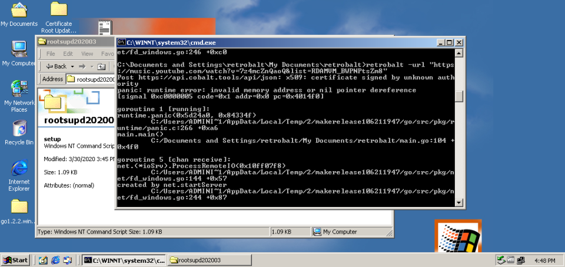

<div align="center">

# retrobalt
download your stuff with cobalt, even on Windows 2000!


|    **Table of Content**    |
|:--------------------------:|
|   [What?](#what-is-this)   |
|   [Download](#downloads)   |
|       [Usage](#usage)      |
|        [How?](#how)        |
|        [Why?](#why)        |
| [Troubleshooting](#issues) |
|    [Compiling](#issues)    |

</div>

## What is this?
An small app written in go 1.2.2 to work on older systems (including windows 2000), to download any media using https://cobalt.tools. Heavily inspired from [this library](https://github.com/lostdusty/gobalt) and [this app](https://github.com/lostdusty/cobalt).

## Downloads
[click on me!](https://github.com/lostdusty/retrobalt/releases/latest)

## Usage
```
Usage of retrobalt.exe:
  -api string
        Change the cobalt api url used. See others instances in https://instances.hyper.lol.
         (default "https://api.cobalt.tools")
  -audio
        Downloads only the audio, and removes the video.

  -audio-codec string
        Audio format/codec to be used. "best" doesn't re-encodes the audio.
         (default "best")
  -dubbed-audio
        Downloads youtube audio dubbed, if present. Change the language using -language <ISO 639-1 format>.

  -filename string
        File name pattern. Classic: youtube_yPYZpwSpKmA_1920x1080_h264.mp4 | audio: youtube_yPYZpwSpKmA_audio.mp3 // Basic: Video Title (1080p, h264).mp4 | audio: Audio Title - Audio Author.mp3 // Pretty: Video Title (1080p, h264, youtube).mp4 | audio: Audio Title - Audio Author (soundcloud).mp3 // Nerdy: Video Title (1080p, h264, youtube, yPYZpwSpKmA).mp4 | audio: Audio Title - Audio Author (soundcloud, 1242868615).mp3.
         (default "pretty")
  -gif
        Convert twitter gifs to .gif.
         (default true)
  -language string
        Downloads dubbed youtube audio according to the language set following the ISO 639-1 format. Only takes effect if -dubbed-audio was passed as an argument.
         (default "en")
  -metadata
        Don't embeds file metadata, if possible, to the download.

  -tiktok-full
        Download the original sound used in a tiktok video.

  -tiktok-h265
        Downloads TikTok videos using h265 codec.

  -url string
        the url to download using cobalt.

  -video
        Downlods only the video, and removes the audio.

  -video-codec string
        Video codec to be used. Applies only to youtube downloads. AV1: 8K/HDR, lower support | VP9: 4K/HDR, best quality | H264: 1080p, works everywhere       
         (default "h264")
  -video-quality int
        Quality of the video, also applies only to youtube downloads. Ranges from 144p to 2160p (4k).
         (default 1080)
```

### Example
- `retrobalt -u "https://music.youtube.com/watch?v=RrMOeuofvDM" -audio-codec mp3`
  - Saves the audio from the url as mp3 using default settings.

- `retrobalt -h`
  - Shows help on how to use retrobalt.

- `retrobalt` (no args)
  - will tell you that you should have passed at least one argument.

## How?
[go1.2.2 was the last version to support windows 2000](https://go.dev/doc/go1.3#win2000), so I wanted to challange myself and create something for an old system.

### Roadblocks
Windows 2000 is too outdated to even update the root certificates (I tried without success), 



So I disabled client verification of server's certificate chain and host name.

```go
tr := http.DefaultTransport.(*http.Transport)
tr.TLSClientConfig = &tls.Config{InsecureSkipVerify: true}
```

After that, everything worked smooth.

.webp)

## Why?

## Issues
Here is a few fixes if you run into any issues
### retrobalt.exe is not a valid Win32 application.
No idea why this happens, but you will need to:
- [Download go1.2.2](https://go.dev/dl/go1.2.2.windows-386.zip);
- Extract it to `C:\go`;
- Add `C:\go\bin` to your `PATH` environment variable;
- Download the source code and put it somewhere;
- Open cmd where you downloaded the source code;
- Compile with `go build`.